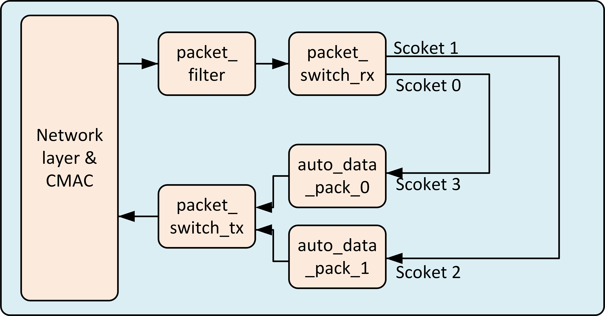
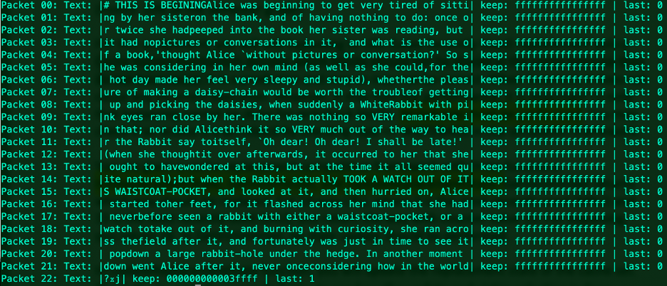
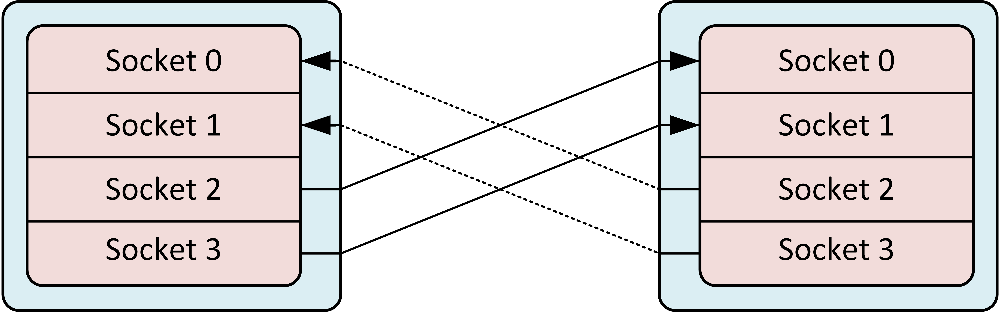

# OCT-FPGA template project for Nextlab 

Rewrite for OCT-FPGA/udp-network-demo (https://github.com/OCT-FPGA/udp-network-demo.git)
Makefile based on (https://github.com/ngdxzy/Vitis_Make.git)

This work can only be run on OCT-FPGA fpga-tools server due to a license problem.

## Differences with OCT-FPGA/udp-network-demo

Reorgnized the files, the current project architecture is like this:

    .
    ├── host_src
    │   ├── ALICE29.txt
    │   ├── alice29.txt
    │   ├── fileops.cpp
    │   ├── fileops.h
    │   ├── head.cpp
    │   ├── networking
    │   │   ├── Makefile
    │   │   ├── oct_fpga.hpp
    │   │   └── udp_setup.cpp
    │   ├── node.cpp
    │   └── tail.cpp
    ├── kernel_src
    │   ├── Base_IPs
    │   │   ├── cmac_0.xo
    │   │   ├── cmac_1.xo
    │   │   ├── networklayer.xo
    │   │   └── synthesis_results_HMB
    │   ├── bit_container_0
    │   │   ├── Makefile
    │   │   ├── auto_data_pack.cpp
    │   │   ├── linker.cfg
    │   │   ├── packet_filter.cpp
    │   │   ├── packet_switch_rx.cpp
    │   │   ├── packet_switch_tx.cpp
    │   │   ├── rxkrnl.cpp
    │   │   ├── txkrnl.cpp
    │   │   ├── xcd.log
    │   │   └── xrc.log
    │   ├── bit_container_1
    │   │   ├── Makefile
    │   │   ├── auto_data_pack.cpp
    │   │   ├── bridge.cpp.bk
    │   │   ├── linker.cfg
    │   │   ├── packet_filter.cpp
    │   │   ├── packet_p2s.cpp
    │   │   ├── packet_s2p.cpp
    │   │   ├── packet_switch_rx.cpp
    │   │   ├── packet_switch_tx.cpp
    │   │   ├── xcd.log
    │   │   └── xrc.log
    │   ├── bit_container_2
    │   │   ├── Makefile
    │   │   ├── auto_data_pack.cpp
    │   │   ├── linker.cfg
    │   │   ├── packet_filter.cpp
    │   │   ├── packet_switch_rx.cpp
    │   │   ├── packet_switch_tx.cpp
    │   │   ├── xcd.log
    │   │   └── xrc.log
    │   ├── post_sys_link.tcl
    │   └── templates
    │       ├── connectivity_if0.ini
    │       ├── connectivity_if1.ini
    │       └── connectivity_if3.ini
    ├── Makefile
    ├── README.md
    ├── head_ip.ini
    ├── node_ip.ini
    ├── tail_ip.ini
    ├── sync.sh
    └── vitis_setup.sh

### Some important files and folders

#### host_src
All host sources. In this template project, simplified sender program and receiver program are included.

#### host_src/fileops
Read file into dynamic allocated RAM space. Provided by OCT-FPGA group.

#### oct_fpga.hpp
APIs for OCT-FPGA key kernels (networklayer and cmac). Two classes are defined in the header file and all communications between host and FPGA kernels are implemented by Xilinx Native APIs rather than opencl based APIs used by OCT-FPGA group.

#### host_src/networking
The Network layer and CMAC are actully free-running kernels. They can be setup before running user application so that the user do not need to worry about the networking staff.

#### kernel_src/Base_IPs
Supported IPs for OCT-FPGA infrastructure. Provided by OCT-FPGA group.

#### kernel_src/bit_container_*
Since different FPGAs may use different bitstreams in future, multiplie bitstreams are required. To avoid creating independent project for each bitstream, user can just create folders named as ```bit_container_<#>```. Each bit_container has its own Makefile. User have to change the ```CONTAINER_ID := <#>``` in the Makefile to avoid confliction. This scheme could be improved in future.

#### kernel_src/post_sys_lick.tcl
It could be a vivado tcl file to connect clocks to CMAC kernels. Provided by OCT-FPGA group.

#### kernel_src/templates:
Template linker file provided by OCT-FPGA group. It is just for reference. User have to provide the link information in ```kernel_src/bit_container_*/linker.cfg```.

#### vitis_setup.sh
A script just for set environment variables including the floating license for generating bitstream for CMAC. It must be sourced before making.

## Differences with original Vitis_Make

The OCT-FPGA has cross FPGA functions so it is impossible to do any emulations. Therefore, the build target is hw by default. This also avoids all possible debuging tools provided by Xilinx. Therefore, it is suggested to evaluate each user IP in Vitis_HLS first and then put them into this project. Hence, make targets like run, kill that were supported by Vitis_Make project templated are removed.

The Makefile in the first folder detectes how many bit_containers are required first, and it calls each Makefile inside ```kernel_src/bit_container_*``` to build all bit_containers.

Now, the Makefile doesn't copy built files into the project folder. User can find them in ```build``` folder (it will show up after build). Host exes are in ```build/host```, bit containers are in ```build/bit_container_*/vivado/``` 

# Template project & new Infrastructures

In this demo, the txkrnl_0 sends alice29.txt and the txkrnl_1 sends ALICE29.txt. The network configuration allows data propagate from FPGA0 (head) to FPGA1 (node) and the to FPGA2 (tail), and finally go back to FPGA0. In node FPGA, data received from socket 0 is forwarded to socket 2 and data received from socket 1 is forwarded to socket 3; In tail FPGA, it is reversed, which means data received from socket 0 is forwarded to socket 3 instead.

With this configuration, the rxkrnl_0 should receive data from txkrnl_1 (ALICE29.txt); the rxkrnl_1 shuold receive data from txkrnl_0. The ALICE29.txt has same content with alice29.txt but the lowercase characters are replaced with capital case and vice versa.


## Bit containers
### bit_container_0
Head FPGA, sending and receiving data.


### bit_container_1
Tail FPGA, looping back data, switch the odd and even sockets.


### bit_container_2
Tail FPGA, looping back data, switch the odd and even sockets.


## Infrastructure kernels

### auto_data_pack
The network layer sends at most 1408 Bytes for a UDP packet, which is 22 AXI-Stream transitions (512 bits/ 64 Bytes). TLAST signal should be set for the every 22 transitions or the last transition of the data (Must be a multiple of 64 Bytes). The purpose of the kernel is to make the Network layer totally transparent to users. It has one reconfigurable port ``desitination`` (specifying which socket should the data been sent to) mapped at ```0x10``` on AXI-Lite interface. Then, it has a 512 bits stream in without side channels connecting to the user kernel and a 512 bits stream out whith side channels connecting to the Network layer. It automatically set the tlast bit every 1408 Bytes. If the 1408 Bytes is not completed, it will send a empty data with TLAST = 1 after 1024 cycles to let the Network layer send the current data that have been received.

### packet_filter
The network layer always sends an extra 64 Bytes (512 bit) AXI-Stream transition every UDP packet. If not handled, it will pollute the data. The figure shows the actully data received when sending 1408 Bytes:


As you can see, we should expect 22 transitions but 23 occured. It is lucky that we can easily filter it out as the TKEEP is not all 1 and the TLAST is not 0.

### packet_switch_tx

This kernel combines two streams with different destination to one single stream so that it can be conncted with the Network layer.

### packet_switch_rx

This kernel seperates the input stream from the Network layer (two different sockets could be receving data) into two output streams so that they can be connected to two user kernel seperatly. Currently, the last bit of 'My port' is used to sperate it; the data from even port number socket is sent to stream_out_0 and that from odd port number is sent to stream_out_1.

# IP and socket setup

In this topology, one socket is only used for sending or receiving data (not bidirectional). In order to make all nodes identical, sockets 2 and 3 are only used to send data; socket 0 and 1 are only used to receive data, as is shown below:



The dashed line means some more nodes could be inserted between the FPGAs, so that it could be a loop.

# How to use
To compile, simply type:

```shell

source vitis_setup.sh
make all TARGET=hw -j<threads>
```

Start an experiment on Cloudlab with 3 FPGA nodes. Set the host accroding to the nodes list in ```~/.ssh/config``` like this:

```shell
Host OCT_FPGA_NODE0
	HostName pc155.cloudlab.umass.edu
	User <USER NAME>
	IdentityFile <absolute path to your private key>
 
Host OCT_FPGA_NODE1
	HostName pc158.cloudlab.umass.edu
	User <USER NAME>
	IdentityFile <absolute path to your private key>

Host OCT_FPGA_NODE2
	HostName pc154.cloudlab.umass.edu
	User <USER NAME>
	IdentityFile <absolute path to your private key>
```

Then run ```./sync.sh/``` to copy all files to the FPGA nodes.

The network configuration is in *_ip.ini, the first line is the self IP address, the gateway and MAC address is deduced based on the IP address. Then, it follows with ```<My_Port>:<Their_IP>:<Their_Port>``` socket information. You can have at most 16 different sockets.


## Overall flow

1. Go to OCT_FPGA_NODE0, run udp_setup;
2. Go to OCT_FPGA_NODE1, run udp_setup;
3. Go to OCT_FPGA_NODE2, run udp_setup, and run tail_bin;
4. Go to OCT_FPGA_NODE1, run udp_setup again, and then run node_bin;
5. Go to OCT_FPGA_NODE0, run udp_setup again,
6. On OCT_FPGA_NODE0, you can run head_bin for as many times as you want.

## OCT_FPGA_NODE0
```shell
TWei_URI@node0:~$ ./udp_setup bit_container_0.xclbin head_ip.ini
Using FPGA binary file specfied through the command line: bit_container_0.xclbin
Setting up CMAC 0
Get user specified IP address: c0a8900a
Get 00th socket conncection 192.168.144.10:50000 <->  192.168.144.30:60000
Get 01th socket conncection 192.168.144.10:50001 <->  192.168.144.30:60001
Get 02th socket conncection 192.168.144.10:50002 <->  192.168.144.20:60002
Get 03th socket conncection 192.168.144.10:50003 <->  192.168.144.20:60003
Using gateway: c0a890ff
Using MAC: f1f2f3f40a
Loading bit_container_0.xclbin
Device name:  xilinx_u280_xdma_201920_3
Device bdf:   0000:3b:00.1
There are 16 hardware sockets.
TX status 0
RX status 3
Link is as active!

# !!! RUN SAME CMD AGAIN AFTER YOU SET UP THE OTHER TWO NODES
TWei_URI@node0:~$ ./udp_setup bit_container_0.xclbin head_ip.ini
Using FPGA binary file specfied through the command line: bit_container_0.xclbin
Setting up CMAC 0
Get user specified IP address: c0a8900a
Get 00th socket conncection 192.168.144.10:50000 <->  192.168.144.30:60000
Get 01th socket conncection 192.168.144.10:50001 <->  192.168.144.30:60001
Get 02th socket conncection 192.168.144.10:50002 <->  192.168.144.20:60002
Get 03th socket conncection 192.168.144.10:50003 <->  192.168.144.20:60003
Using gateway: c0a890ff
Using MAC: f1f2f3f40a
Loading bit_container_0.xclbin
Device name:  xilinx_u280_xdma_201920_3
Device bdf:   0000:3b:00.1
There are 16 hardware sockets.
ARP valid entry found at 20
ARP valid entry found at 30
TX status 0
RX status 3
Link is as active!

# Now you can see the valid APR been found

TWei_URI@node0:~$ ./head_bin bit_container_0.xclbin 512
Using FPGA binary file specfied through the command line: bit_container_0.xclbin
Send 512 Bytes to Sokcet 0
File alice29.txt read!
File ALICE29.txt read!
All kernel started!
All kernel finished!
All kernel started!
All kernel finished!
************************************************
# this is begining aLICE WAS BEGINNING TO GET VERY TIRED OF SITTI
NG BY HER SISTERON THE BANK, AND OF HAVING NOTHING TO DO: ONCE O
R TWICE SHE HADPEEPED INTO THE BOOK HER SISTER WAS READING, BUT
IT HAD NOPICTURES OR CONVERSATIONS IN IT, `AND WHAT IS THE USE O
F A BOOK,'THOUGHT aLICE `WITHOUT PICTURES OR CONVERSATION?' sO S
HE WAS CONSIDERING IN HER OWN MIND (AS WELL AS SHE COULD,FOR THE
 HOT DAY MADE HER FEEL VERY SLEEPY AND STUPID), WHETHERTHE PLEAS
URE OF MAKING A DAISY-CHAIN WOULD BE WORTH THE TROUBLEOF GETTIN
************************************************
# THIS IS BEGINING Alice was beginning to get very tired of sitti
ng by her sisteron the bank, and of having nothing to do: once o
r twice she hadpeeped into the book her sister was reading, but
it had nopictures or conversations in it, `and what is the use o
f a book,'thought Alice `without pictures or conversation?' So s
he was considering in her own mind (as well as she could,for the
 hot day made her feel very sleepy and stupid), whetherthe pleas
ure of making a daisy-chain would be worth the troubleof gettin
************************************************


```
512 can be replaced by any number below 4096 and must be a multiple of 64.
You may need to run udp_setup again after all other FPGAs are setup correctly. You should see 2 ARP valid entris.

The transition should be very fast, the host wait 3 seconds for debuging purpose.

You can see that the rxkrnl_0 got a ALICE29.txt and rxkrnl_1 gets alice29.txt

## OCT_FPGA_NODE1
```bash

TWei_URI@node1:~$ ./udp_setup bit_container_2.xclbin node_ip.ini
Using FPGA binary file specfied through the command line: bit_container_2.xclbin
Setting up CMAC 0 
Get user specified IP address: c0a89014
Get 00th socket conncection 192.168.144.20:60002 <->  192.168.144.10:50002
Get 01th socket conncection 192.168.144.20:60003 <->  192.168.144.10:50003
Get 02th socket conncection 192.168.144.20:50000 <->  192.168.144.30:60002
Get 03th socket conncection 192.168.144.20:50001 <->  192.168.144.30:60003
Using gateway: c0a890ff
Using MAC: f1f2f3f414
Loading bit_container_2.xclbin
Device name:  xilinx_u280_xdma_201920_3
Device bdf:   0000:3b:00.1
There are 16 hardware sockets.
ARP valid entry found at 10
TX status 0
RX status 3
Link is as active!

# !!! YOU CAN SEE ARP 10. RUN IT AGAIN AFTER SET UP ALL FPGAS

TWei_URI@node1:~$ ./udp_setup bit_container_2.xclbin node_ip.ini
Using FPGA binary file specfied through the command line: bit_container_2.xclbin
Setting up CMAC 0 
Get user specified IP address: c0a89014
Get 00th socket conncection 192.168.144.20:60002 <->  192.168.144.10:50002
Get 01th socket conncection 192.168.144.20:60003 <->  192.168.144.10:50003
Get 02th socket conncection 192.168.144.20:50000 <->  192.168.144.30:60002
Get 03th socket conncection 192.168.144.20:50001 <->  192.168.144.30:60003
Using gateway: c0a890ff
Using MAC: f1f2f3f414
Loading bit_container_2.xclbin
Device name:  xilinx_u280_xdma_201920_3
Device bdf:   0000:3b:00.1
There are 16 hardware sockets.
ARP valid entry found at 10
ARP valid entry found at 30
TX status 0
RX status 3
Link is as active!

# you should see ARP at 30 now. Run the node_bin to set up auto_data_pack.

TWei_URI@node1:~$ ./node_bin bit_container_2.xclbin
Using FPGA binary file specfied through the command line: bit_container_2.xclbin
All kernel finished!

```

You may need to run udp_setup again after all other FPGAs are setup correctly. You should see 3 ARP valid entris.

## OCT_FPGA_NODE2

```bash
TWei_URI@node2:~$ ./udp_setup bit_container_1.xclbin tail_ip.ini
Using FPGA binary file specfied through the command line: bit_container_1.xclbin
Setting up CMAC 0
Get user specified IP address: c0a8901e
Get 00th socket conncection 192.168.144.30:60002 <->  192.168.144.20:50000
Get 01th socket conncection 192.168.144.30:60003 <->  192.168.144.20:50001
Get 02th socket conncection 192.168.144.30:60000 <->  192.168.144.10:50000
Get 03th socket conncection 192.168.144.30:60001 <->  192.168.144.10:50001
Using gateway: c0a890ff
Using MAC: f1f2f3f41e
Loading bit_container_1.xclbin
Device name:  xilinx_u280_xdma_201920_3
Device bdf:   0000:3b:00.1
There are 16 hardware sockets.
ARP valid entry found at 10
ARP valid entry found at 20
TX status 0
RX status 3
Link is as active!

# You should see ARP at 10 and 20 immediately. The last node doesn't need to run udp_setup twice.

TWei_URI@node2:~$ ./tail_bin bit_container_1.xclbin
Using FPGA binary file specfied through the command line: bit_container_1.xclbin
All kernel finished!

```

# Build Targets

## all (default target)

Build kernels, link kernels, build host program and copy them to the current folder.

## kernel

Build kernels. The new kernels are saved in the ./build/vitis_hls. The temporay hls projects are also saved there so that they can be opend with GUI and you can check the scheduling and debuging the kernel.

To open the vitis_hls project for each kernel, you can use:
```shell

vitis_hls -p build/bit_container_*/vitis_hls/<kernel_name>/<kernel_name>/<kernel_name>

```


## link

Link the kernels. The linker file ./kernel_src/linker.cfg shall be edit beforehead. The xclbin will be generated in ./build/vivado. Build link will trigger build the kernels if the kernels haven't been build before.

To open the vivado project, you can use:
```shell

vivado -p build/bit_container_*/vivado/link/vivado/vpl/prj/prj.xpr

```
## host

Just build the host excutable file. It does not depend on any other objects.

## clean

Clean up the project. Be careful.

## network
Get udp ip setup.

